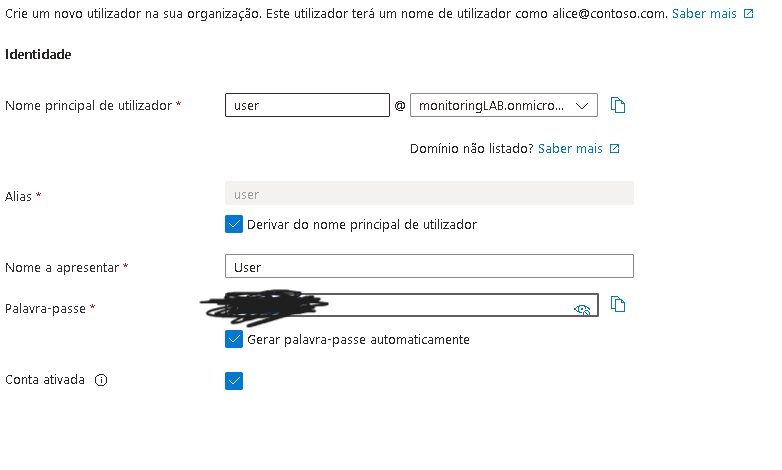
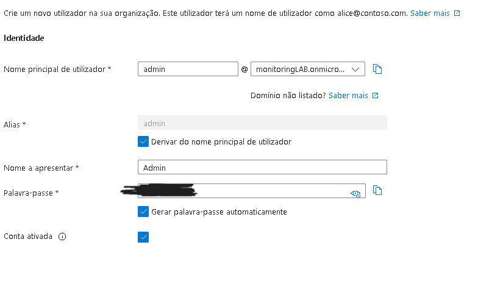
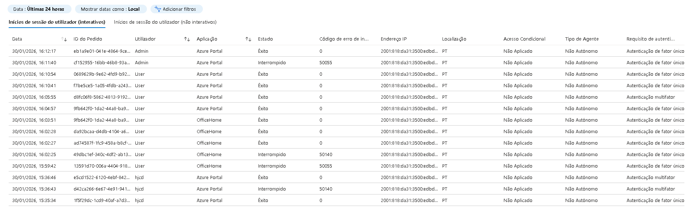
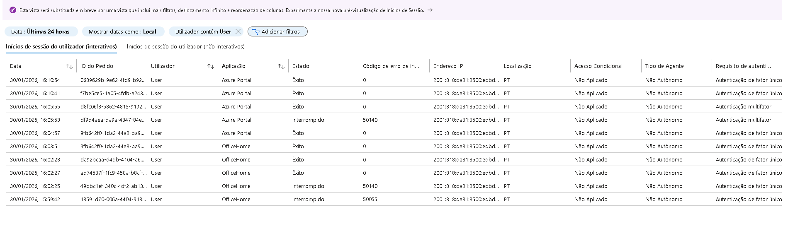

# Azure Identity Security Lab

## Overview
This is a hands-on lab focused on securing Microsoft Entra ID (Azure AD) identities using Conditional Access, Multi-Factor Authentication (MFA), and monitoring sign-in activities. The project demonstrates fundamental identity security skills for cloud security and SOC roles.

## Objectives
- Create test users and groups
- Enforce MFA for all users
- Configure Conditional Access policies
- Analyze sign-in logs for suspicious activity
- Create alerts using Log Analytics and Azure Monitor

## Architecture & Workflow
1. **Users & Groups:** Created `user.test` and `admin.test`, grouped in `grp-users` and `grp-admins`.
2. **MFA Enforcement:** Required MFA for all users.
3. **Conditional Access:** Policy `CA-Require-MFA-All-Users` applied to all cloud apps.
4. **Sign-in Monitoring:** Logs collected from Microsoft Entra ID sign-ins.
5. **Alerting:** Configured alerts for failed logins and MFA enforcement.

## Screenshots

## Lessons Learned
- Importance of identity protection in cloud environments
- MFA and Conditional Access as core security measures
- Log analytics and alerts for SOC monitoring
- Understanding Azure Free / Students limits
